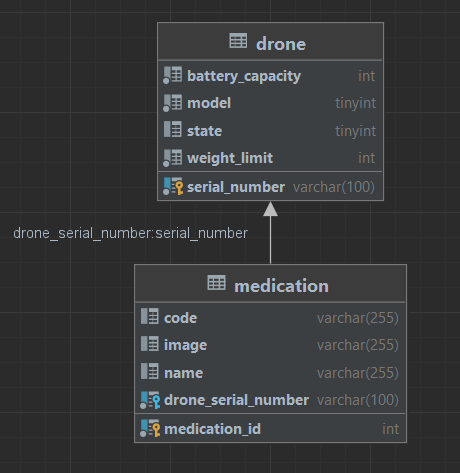

# Elmenus Technical Task

## Tools used


## Diagrams

### Database Diagram



## How to run the project

#### 1- Clone the project

```bash
git clone https://github.com/AdhamMadkour/dji-drone-rest.git
```

### 2- Configure the database

    * Create a database with preferred name
    * Change the datasource url in application.properties file
    * Change the username and password in application.properties file
    * Go to the drone.sql file and copy the content and paste it in your database query console and run it
    * Go to the medication.sql file and copy the content and paste it in your database query console and run it
    * Now you have the database ready to run the project

### 3- Run the `DjiDroneRestApplicationTests` class

### 4- Run the project `DjiDroneRestApplication` class

### 5- Now you can use the API

## API Documentation

Base URL: `http://localhost:8080`

### Note

**Requests must be made with JSON type**

```
Content-Type: application/json
```

## Endpoints

The API supports the following endpoints:

## 1. Get all drones

Returns a list of all drones in the database with their loaded medication items.

###  Query Parameters to filter the results

| Parameter       | Type     | Description                    |
|:----------------|:---------|:-------------------------------|
| `pageNumber`    | `int`    | The page number of the results |
| `pageSize`      | `int`    | The page size of the results   |
| `sortBy`        | `String` | The field name to sort by      |
| `sortDirection` | `String` | The direction of the sorting   |

```HTTP
GET /api/drones
```

- Example response:
  ```JSON
  [
    {
        "serialNumber": "AB",
        "model": "Heavyweight",
        "weightLimit": 50,
        "batteryCapacity": 50,
        "state": "DELIVERING",
        "medications": [
            {
                "id": 6,
                "name": "dawaa",
                "code": "123456789",
                "weight": 20,
                "image": "dawaa.jpg"
            },
            {
                "id": 7,
                "name": "bestInTheWest",
                "code": "65433fg",
                "weight": 30,
                "image": "bestInTheWest.jpg"
            }
        ]
    }]
  ```

## 2. Register a new drone

Registers a new drone in the database.

```HTTP 
POST /api/drone
```

- Example request body:

```JSON
{
  "serialNumber": "ABC",
  "model": "Heavyweight",
  "weightLimit": 50,
  "batteryCapacity": 12,
  "state": "LOADING"
}
```

- Example response:

```JSON
{
  "serialNumber": "ABC",
  "model": "Heavyweight",
  "weightLimit": 50,
  "batteryCapacity": 12,
  "state": "LOADING"
}
```

## 3. Checking loaded medication items for a given drone

Returns a Drone object with its loaded medication items.

```HTTP
GET /api/drone/{serialNumber}
```

| Parameter | Type     | Description                        |
|:----------|:---------|:-----------------------------------|
| `id`      | `string` | The unique identifier of the Drone |

- Example response:

```JSON
{
  "serialNumber": "ABC",
  "model": "Heavyweight",
  "weightLimit": 50,
  "batteryCapacity": 12,
  "state": "LOADING",
  "medications": [
    {
      "id": 6,
      "name": "dawaa",
      "code": "123456789",
      "weight": 20,
      "image": "dawaa.jpg"
    },
    {
      "id": 7,
      "name": "bestInTheWest",
      "code": "65433fg",
      "weight": 30,
      "image": "bestInTheWest.jpg"
    }
  ]
}
```

## 4. Loading a medication

Loads a medication item into a drone.

```HTTP
POST /api/medication
```

- Example request body:

```JSON
{
  "name": "dawaa",
  "code": "123456789",
  "weight": 20,
  "image": "dawaa.jpg",
  "drone": {
    "serialNumber": "ABC"
  }
}
```

> **Note:** The API will return an error if the drone is not in `LOADING` state or
> the medication item's weight exceeds the drone's weight limit.

- Example response:

```JSON
{
  "id": 6,
  "name": "dawaa",
  "code": "123456789",
  "weight": 20,
  "image": "dawaa.jpg"
}
```

## 5. Checking available drones for delivery

Returns a list of all available drones in state `IDLE`

```HTTP
GET /api/drones/available
```

- Example response:

```JSON
[
  {
    "serialNumber": "DJI0004",
    "model": "Cruiserweight",
    "weightLimit": 250,
    "batteryCapacity": 100,
    "state": "IDLE",
    "medications": [
      {
        "id": 8,
        "name": "Paracetamol",
        "code": "PCT",
        "weight": 10,
        "image": "paracetamol.jpg"
      }
    ]
  },
  {
    "serialNumber": "DJI0005",
    "model": "Cruiserweight",
    "weightLimit": 250,
    "batteryCapacity": 20,
    "state": "IDLE",
    "medications": [
      {
        "id": 12,
        "name": "Paracetamol",
        "code": "PCT",
        "weight": 10,
        "image": "paracetamol.jpg"
      }
    ]
  },
  {
    "serialNumber": "jsdfhksd",
    "model": "Heavyweight",
    "weightLimit": 50,
    "batteryCapacity": 25,
    "state": "IDLE",
    "medications": []
  }
]
```

## 6. Checking the Drone Battery Status

Returns the battery status of a drone.

```HTTP
GET /api/dronebattery/{serialNumber}
```

| Parameter | Type     | Description                        |
|:----------|:---------|:-----------------------------------|
| `id`      | `string` | The unique identifier of the Drone |

- Example response:

```JSON
{
  "serialNumber": "AB",
  "batteryPercentage": 50
}
```

## 7. There is also more details in the swagger documentation

```
http://localhost:8080/swagger-ui/index.html
```
