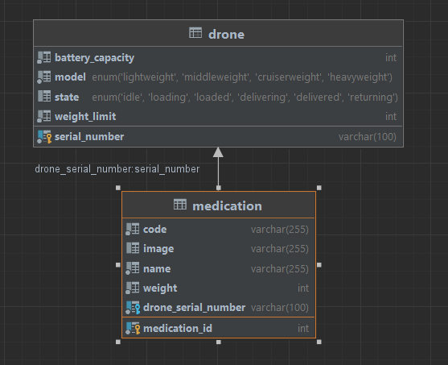

# Elmenus Technical Task

## Tools used 


## Diagrams
### Database Diagram



## How to run the project


## API Documentation

 Base URL: `http://localhost:8080`

### Note

**Requests must be made with JSON type**

```
Content-Type: application/json
```
## Endpoints
The API supports the following endpoints:

### 1. Get all drones
Returns a list of all drones in the database.

```HTTP
GET /api/drones
```
- Example response:
  ```JSON
  [
    {
        "serialNumber": "AB",
        "model": "Heavyweight",
        "weightLimit": 50,
        "batteryCapacity": 50,
        "state": "DELIVERING",
        "medications": [
            {
                "id": 6,
                "name": "dawaa",
                "code": "123456789",
                "weight": 20,
                "image": "dawaa.jpg"
            },
            {
                "id": 7,
                "name": "bestInTheWest",
                "code": "65433fg",
                "weight": 30,
                "image": "bestInTheWest.jpg"
            }
        ]
    }]
  ```